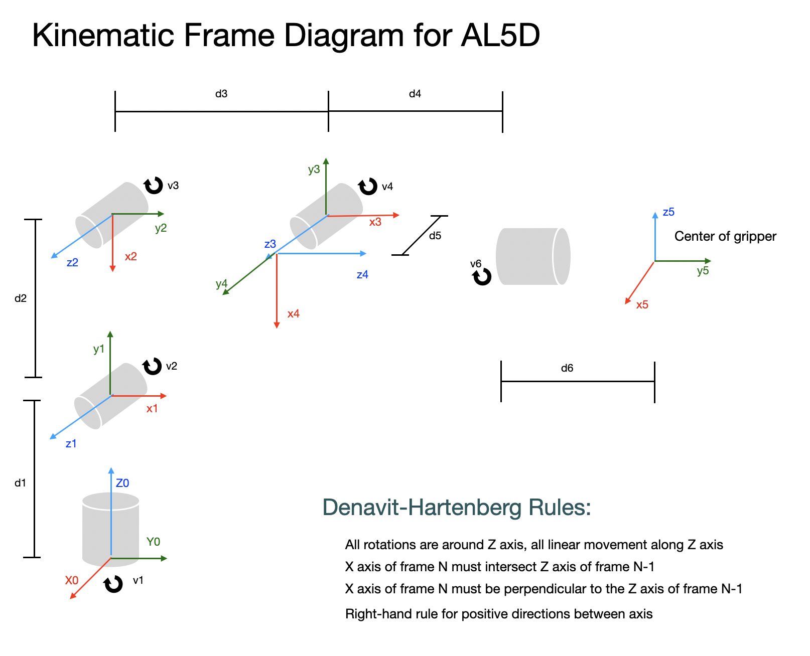

RoboticArm is a program for working with the LynxMotion AL5D robotic arm with the SSC-32U interface on a Macintosh.

The program uses SwiftUI, Combine, and SceneKit; so will require Catalina for operation.

It was built using XCode 11.4

### Features:
* 3D image of robotic arm
* Control of arm through USB port
* Forward kinematics
* Inverse kinematics

#### Important notes
* Note:  You must install the FTDI drivers for this program to talk to the arm.  The link to get the drivers is [here](http://www.ftdichip.com/Drivers/VCP.htm).
* The program is not sandboxed (talking to USB devices directly is discouraged in security models)

#### Servo Calibration
The parameters in the setCalibrationAngles calls in the file RobotArm.swift can be used to calibrate servo angles to the pulse width being sent by the SSC-32U.  The following procedure is used:
1. Make sure the calibration constants are +/- 90 degrees so that a 500μs pulse and 2500μs pulse is sent for the two extremes on the slider. (Except the elbow, which is limited physically to about 70 degrees in one direction - so you will have to extrapolate from something like 60 degrees setting and multiply the measured angle by 1.5)
2. Measure the angle the servo makes when the slider is at the limit (-90 or +90 degrees).  Use this value for the calibration angle.
3. Note that the slider angle does not necessarily correlate in the +/- direction to the short and long pulses (in fact most are reversed).  This is due to the Denavit-Hartenberg frames of reference used in the internal model, and some liberties on directions I took when building the program.  You may have to experiment to find which of the two values is for which rotation direction.

#### Working notes
* The port drop-down list selection does not update after program initialization, so a restart will be required if the arm is not plugged in prior to starting the program.
* You do not have to have the SSC-32U powered for the port to appear, just to move the servos.
* If the program is not talking to the arm, you may reset the port connection by re-selecting the port from the drop-down list (even if there is only one port in the list)
* The simulation stops if the end effector is calculated (by forward kinematics) to be below the surface.  Reset by centering all servos
* Make sure you hit return after entering the last coordinate for the inverse kinematics before clicking the button, else the value is not entered and the old value is used!
* There was a problem of infinite alert dialogs when I tried to use one for feedback on the inverse kinematics (error in SwiftUI?), so just a text field appears at the bottom-left of the window

#### Additions I am working on...
* Gripper force feedback

#### Image of Application in action

#### Kinematic Diagram showing Denavit-Hartenberg Frames

